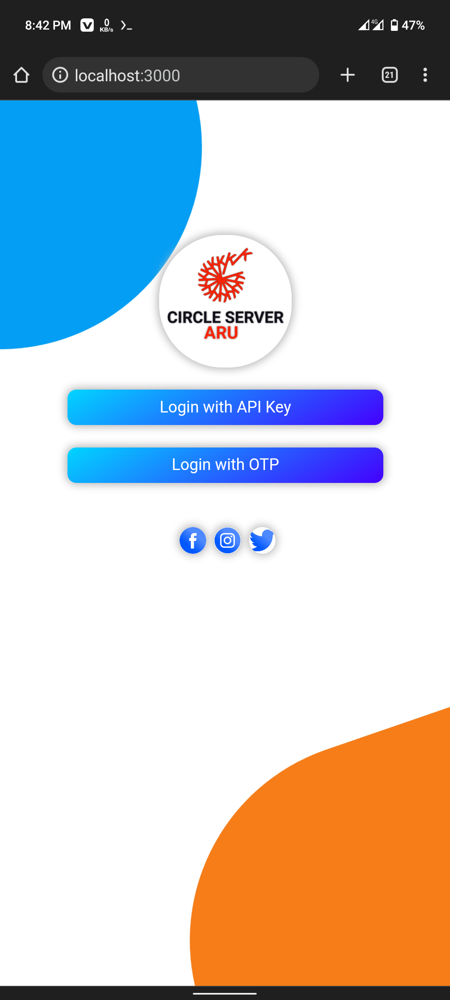

<div align="center">

</div>

<div>
<p> If you want to use it then you use below commands </p>

<p> Since it is built with node js, you need to install node js first </p>

```shell
pkg install nodejs
```

<p> Then clone this repository </p>

```shell
git clone https://github.com/Aru-Ofc-git/CIRCLE-ID-TO-NUMBER-SERVER.git
```
<p> Then change directory </p>

```
cd CIRCLE-ID-TO-NUMBER-SERVER
```

<p> Then run this project </p>

```
bash runServer.sh
```

<p> Then open your browser and visit <a href="http://localhost:3000/"> http://localhost:3000/</a></p>
</div>

<div align="center">
<h1> Main Page Screenshot </h1>

<h1> Login with API </h1>

<h1> Login with Phone </h1>

<h1> Home Page </h1>

</div>
